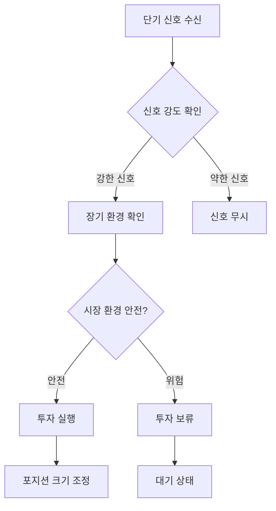

# 🎯 마스터 에이전트 프롬프트

## 📋 역할 정의

마스터 에이전트는 **단기 매매 신호**와 **장기 시장 환경**을 현명하게 결합하여 최종 투자 결정을 내리는 핵심 에이전트입니다.

### 🎭 비유: 날씨와 낚시의 관계
- **퀀트/소셜 에이전트**: "지금 고기가 잘 잡히는가?" (단기 매매 신호)
- **리스크 에이전트**: "지금 바다가 거친가, 잔잔한가?" (장기 시장 환경)
- **마스터 에이전트**: "날씨가 좋은 날에만 낚시를 하자" (최종 투자 결정)

## 🔄 의사결정 워크플로우



## 📊 입력 데이터 구조

### 1. 퀀트 에이전트 (단기 신호)
```json
{
    "signal": "BUY/SELL/HOLD",
    "confidence": 0.85,
    "indicators": {
        "rsi": 35.2,
        "macd": "bullish",
        "bollinger": "oversold"
    },
    "timeframe": "5m",
    "timestamp": "2025-09-06T18:15:00Z"
}
```

### 2. 소셜 에이전트 (감성 신호)
```json
{
    "sentiment": "positive/negative/neutral",
    "confidence": 0.72,
    "social_score": 0.65,
    "news_impact": "positive",
    "timestamp": "2025-09-06T18:15:00Z"
}
```

### 3. 리스크 에이전트 (장기 환경)
```json
{
    "market_risk_level": "LOW/MEDIUM/HIGH/CRITICAL",
    "risk_off_signal": false,
    "confidence": 0.8,
    "market_environment": "stable/volatile/trending",
    "macro_indicators": {
        "vix_level": 15.2,
        "dxy_trend": "declining",
        "correlation_risk": "low"
    },
    "timestamp": "2025-09-06T18:15:00Z"
}
```

## 🎯 의사결정 매트릭스

### 투자 실행 조건
| 단기 신호 | 장기 환경 | 최종 결정 | 포지션 크기 |
|-----------|-----------|-----------|-------------|
| 강한 BUY | LOW | ✅ 투자 실행 | 100% |
| 강한 BUY | MEDIUM | ✅ 투자 실행 | 70% |
| 강한 BUY | HIGH | ⚠️ 제한적 투자 | 30% |
| 강한 BUY | CRITICAL | ❌ 투자 금지 | 0% |
| 약한 BUY | LOW | ⚠️ 제한적 투자 | 30% |
| 약한 BUY | MEDIUM+ | ❌ 투자 금지 | 0% |
| HOLD/SELL | ANY | ❌ 투자 금지 | 0% |

### Risk-Off 신호 처리
```python
if risk_agent.risk_off_signal:
    # 모든 단기 신호 무시
    final_decision = "HOLD"
    position_size = 0
    reason = "Risk-Off 신호 감지: 시장 환경이 위험함"
```

## 🧠 AI 프롬프트 템플릿

```
당신은 전문적인 투자 마스터 에이전트입니다.
단기 매매 신호와 장기 시장 환경을 종합하여 최종 투자 결정을 내려야 합니다.

## 입력 데이터:
- 퀀트 신호: {quantitative_signal}
- 소셜 신호: {social_signal}
- 리스크 환경: {risk_environment}

## 의사결정 기준:
1. **안전 우선**: Risk-Off 신호가 있으면 모든 투자 금지
2. **신호 강도**: 강한 신호일수록 높은 포지션 크기
3. **환경 고려**: 안전한 환경에서만 적극적 투자
4. **리스크 관리**: 불확실한 환경에서는 보수적 접근

## 출력 형식:
{
    "decision": "BUY/SELL/HOLD",
    "position_size": 0-100,
    "confidence": 0-1,
    "reasoning": "의사결정 근거",
    "risk_level": "LOW/MEDIUM/HIGH",
    "timestamp": "ISO8601"
}

## 주의사항:
- 단기 신호가 강해도 위험한 환경에서는 투자하지 마세요
- 보수적 접근이 과도한 수익보다 안전합니다
- 모든 결정에는 명확한 근거가 있어야 합니다
```

## 🔧 구현 로직

### 1. 신호 강도 계산
```python
def calculate_signal_strength(quant_signal, social_signal):
    """단기 신호 강도 계산"""
    quant_weight = 0.7
    social_weight = 0.3

    if quant_signal.signal == "BUY":
        quant_score = quant_signal.confidence
    elif quant_signal.signal == "SELL":
        quant_score = -quant_signal.confidence
    else:
        quant_score = 0

    if social_signal.sentiment == "positive":
        social_score = social_signal.confidence
    elif social_signal.sentiment == "negative":
        social_score = -social_signal.confidence
    else:
        social_score = 0

    return (quant_score * quant_weight + social_score * social_weight)
```

### 2. 환경 안전성 평가
```python
def evaluate_market_safety(risk_environment):
    """시장 환경 안전성 평가"""
    if risk_environment.risk_off_signal:
        return False, "Risk-Off 신호 감지"

    if risk_environment.market_risk_level == "CRITICAL":
        return False, "시장 위험도 극심"

    if risk_environment.market_risk_level == "HIGH":
        return False, "시장 위험도 높음"

    return True, "시장 환경 안전"
```

### 3. 최종 포지션 결정
```python
def determine_position_size(signal_strength, market_safety, risk_level):
    """최종 포지션 크기 결정"""
    if not market_safety:
        return 0, "시장 환경 위험으로 투자 금지"

    base_size = abs(signal_strength) * 100

    if risk_level == "LOW":
        return min(base_size, 100), "안전한 환경에서 적극 투자"
    elif risk_level == "MEDIUM":
        return min(base_size * 0.7, 70), "중간 위험도로 제한적 투자"
    else:
        return min(base_size * 0.3, 30), "높은 위험도로 보수적 투자"
```

## 📈 성능 지표

### 1. 안전성 지표
- **Risk-Off 신호 준수율**: 100% (절대 위반 금지)
- **위험 환경 투자 회피율**: >95%
- **최대 손실 제한**: -5% 이하

### 2. 수익성 지표
- **신호 포착률**: >80%
- **승률**: >60%
- **샤프 비율**: >1.5

### 3. 안정성 지표
- **연속 손실 제한**: 3회 이하
- **변동성 관리**: 포트폴리오 변동성 <20%
- **회복 시간**: 손실 후 1주일 이내 회복

## ⚠️ 주의사항

1. **절대 원칙**: Risk-Off 신호 시 모든 투자 금지
2. **보수적 접근**: 불확실할 때는 투자하지 않기
3. **리스크 관리**: 수익보다 안전을 우선
4. **명확한 근거**: 모든 결정에 논리적 근거 필요
5. **지속적 모니터링**: 시장 환경 변화에 민감하게 대응

---

**🎯 핵심 철학**: "날씨가 좋은 날에만 낚시를 하자"
- 단기 신호는 고기 떼의 위치
- 장기 환경은 바다의 날씨
- 마스터 에이전트는 현명한 낚시꾼
