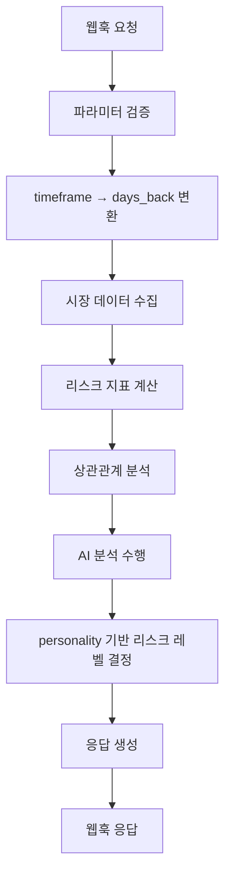

# 🛡️ 리스크 분석 에이전트 (Risk Analysis Agent)

## 📋 개요

리스크 분석 에이전트는 **yfinance**, **LangChain**, **LangGraph**를 활용하여 시장 리스크를 분석하고 요약하는 AI 에이전트입니다. 비트코인 차트 분석을 위한 웹훅과 완벽하게 호환되며, 투자자의 성향에 따라 리스크 임계값을 조정합니다.

## 🎯 주요 기능

### 1. **시장 데이터 수집**
- **yfinance**를 통한 실시간 시장 데이터 수집
- **비트코인 (BTC)**: 가격, 변동성, 24시간 변화율
- **나스닥 (NASDAQ)**: 주식 시장 지수
- **달러 인덱스 (DXY)**: 달러 강도 지표
- **VIX**: 변동성 지수 (공포 지수)
- **금 (Gold)**: 안전자산 가격

### 2. **리스크 지표 계산**
- **비트코인 변동성**: 7일, 30일 변동성 및 백분위수
- **VIX 레벨**: 시장 불안정성 지표
- **달러 인덱스**: 통화 강도 분석
- **종합 리스크 점수**: 0-100점 스케일

### 3. **상관관계 분석**
- 비트코인과 주요 자산 간의 상관관계 계산
- Risk-Off 신호 감지
- 포트폴리오 다각화 인사이트 제공

### 4. **AI 분석 및 요약**
- **LangChain**을 통한 자연어 분석
- 시장 상황 요약
- 리스크 평가 및 주요 리스크 식별
- 투자 기회 분석

### 5. **투자 성향별 리스크 조정**
- **Conservative (보수적)**: 민감한 리스크 감지
- **Neutral (중립적)**: 표준 리스크 임계값
- **Aggressive (공격적)**: 관대한 리스크 임계값

## 🔌 API 엔드포인트

### **POST** `/api/v1/v2/risk/analyze`

#### 요청 파라미터 (웹훅 호환)

```json
{
    "market": "BTC/USDT",           // 분석할 마켓
    "timeframe": "minutes:5",       // 시간프레임 (minutes:5, 1h, 4h, 1d)
    "count": 200,                   // 데이터 포인트 수
    "personality": "neutral",       // 투자 성향 (conservative, neutral, aggressive)
    "include_analysis": true        // AI 분석 포함 여부
}
```

#### 시간프레임 변환 로직

| 웹훅 timeframe | 변환된 days_back | 설명 |
|----------------|------------------|------|
| `minutes:5` | `count * 5분 ÷ (24×60)` | 5분봉 기준 일수 계산 |
| `1h` | `count ÷ 24` | 1시간봉 기준 |
| `4h` | `count ÷ 6` | 4시간봉 기준 |
| `1d` | `count` | 일봉 기준 |

#### 응답 구조

```json
{
    "status": "success",
    "market": "BTC/USDT",
    "timestamp": "2025-09-06T18:05:26.785395+00:00",

    "market_data": {
        "btc_price": 110152.16,
        "btc_change_24h": -0.45,
        "btc_volatility": 29.46,
        "nasdaq_price": 21700.39,
        "nasdaq_change_24h": -0.03,
        "dxy_price": 97.77,
        "dxy_change_24h": -0.59,
        "vix_price": 15.18,
        "vix_change_24h": -0.78,
        "gold_price": 3613.20,
        "gold_change_24h": 1.33
    },

    "risk_indicators": {
        "btc_volatility_7d": 29.46,
        "btc_volatility_30d": 35.36,
        "btc_volatility_percentile": 38.39,
        "vix_level": 15.18,
        "vix_percentile": 17.27,
        "dxy_level": 97.77,
        "dxy_percentile": 38.85,
        "gold_volatility": 2.66,
        "gold_percentile": 100.0,
        "overall_risk_score": 38.65
    },

    "correlation_analysis": {
        "btc_nasdaq_correlation": 0.037,
        "btc_dxy_correlation": 0.382,
        "btc_vix_correlation": 0.287,
        "btc_gold_correlation": -0.170,
        "nasdaq_dxy_correlation": 0.029,
        "nasdaq_vix_correlation": 0.021,
        "dxy_vix_correlation": 0.376,
        "correlation_summary": "주요 자산 간 상관관계가 약하거나 중립적입니다.",
        "risk_off_indicators": []
    },

    "ai_analysis": {
        "market_summary": "현재 비트코인 가격은 $110,152.16로 소폭 하락...",
        "risk_assessment": "현재 시장의 종합 리스크 점수는 38.6/100으로...",
        "key_risks": [
            "비트코인의 높은 변동성",
            "달러 인덱스 하락",
            "낮은 상관관계"
        ],
        "opportunities": [
            "비트코인 장기 투자 기회"
        ],
        "recommendations": "현재 시장의 주요 리스크 요인은...",
        "confidence": 0.8
    },

    "market_risk_level": "LOW",        // LOW, MEDIUM, HIGH, CRITICAL
    "risk_off_signal": false,          // Risk-Off 신호 여부
    "confidence": 0.6,                 // 분석 신뢰도 (0-1)
    "recommendations": null,           // 투자 권장사항 (마스터 에이전트 담당)

    "metadata": {
        "analysis_period": "30일",
        "timeframe": "1d",
        "ai_analysis_included": true,
        "data_points": 0
    }
}
```

## 🎛️ 투자 성향별 리스크 임계값

### Conservative (보수적)
- **CRITICAL**: 리스크 점수 ≥ 70, VIX ≥ 30
- **HIGH**: 리스크 점수 ≥ 50, VIX ≥ 20
- **MEDIUM**: 리스크 점수 ≥ 30, VIX ≥ 15

### Neutral (중립적) - 기본값
- **CRITICAL**: 리스크 점수 ≥ 80, VIX ≥ 35
- **HIGH**: 리스크 점수 ≥ 60, VIX ≥ 25
- **MEDIUM**: 리스크 점수 ≥ 40, VIX ≥ 20

### Aggressive (공격적)
- **CRITICAL**: 리스크 점수 ≥ 90, VIX ≥ 40
- **HIGH**: 리스크 점수 ≥ 70, VIX ≥ 30
- **MEDIUM**: 리스크 점수 ≥ 50, VIX ≥ 25

## 🔄 워크플로우



## 🚀 사용 예시

### cURL 요청
```bash
curl -X POST "http://localhost:8080/api/v1/v2/risk/analyze" \
  -H "Content-Type: application/json" \
  -d '{
    "market": "BTC/USDT",
    "timeframe": "minutes:5",
    "count": 200,
    "personality": "aggressive",
    "include_analysis": true
  }'
```

### Python 요청
```python
import requests

response = requests.post(
    "http://localhost:8080/api/v1/v2/risk/analyze",
    json={
        "market": "BTC/USDT",
        "timeframe": "minutes:5",
        "count": 200,
        "personality": "conservative",
        "include_analysis": True
    }
)

result = response.json()
print(f"리스크 레벨: {result['market_risk_level']}")
print(f"Risk-Off 신호: {result['risk_off_signal']}")
```

## ⚠️ 주의사항

1. **역할 분리**: 리스크 에이전트는 **"시장이 얼마나 위험한가?"**만 분석합니다.
2. **투자 결정**: **"얼마나 투자할까?"**는 마스터 에이전트가 담당합니다.
3. **API 키**: OpenAI API 키가 설정되어야 AI 분석이 작동합니다.
4. **의존성**: yfinance, LangChain, scipy, scikit-learn 패키지가 필요합니다.

## 🔧 설정

### 환경 변수
```bash
export OPENAI_API_KEY="your-openai-api-key"
```

### 의존성 설치
```bash
pip install yfinance langchain langchain-openai scipy scikit-learn
```

## 📊 성능 지표

- **응답 시간**: 평균 2-5초 (AI 분석 포함)
- **데이터 정확도**: yfinance 실시간 데이터 기반
- **AI 분석 품질**: GPT-4o-mini 모델 사용
- **신뢰도**: 0.6-0.9 (분석 조건에 따라)

---

**🎯 핵심**: 리스크 에이전트는 시장 리스크를 정확히 분석하여 마스터 에이전트의 투자 결정을 지원합니다.
